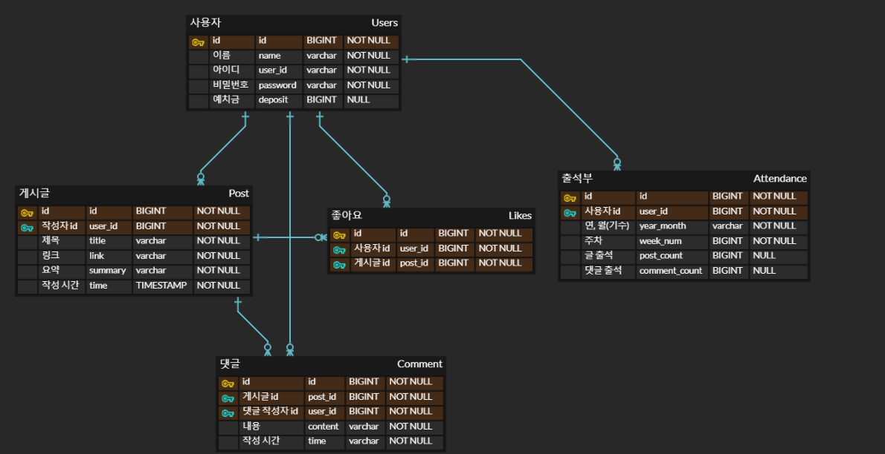

# ⌨️ 기술 블로그 공유 플랫폼

기술 블로그를 공유하고, 리뷰를 달 수 있는 플랫폼입니다.

강제성을 위해, 글을 작성하지 않으면 예치금에서 벌금을 차감합니다.

## 프로젝트 기능 및 설계
- 회원가입, 로그인 기능
    - 회원가입, 로그인 API
        - 사용자는 회원가입, 로그인을 할 수 있다.
    - 인증 기능
        - 로그인하지 않은 사용자도 글과 댓글을 조회할 수 있다.
        - 하지만 글 작성, 댓글 작성, 좋아요 누르기, 활동 기수 신청은 로그인한 사용자만 할 수 있다.
- 게시글 기능
  - 글 작성 API
    - 로그인한 사용자는 기술 블로그를 공유하는 글을 작성할 수 있다.
    - 글의 내용은 \[제목, 기술 블로그 링크, 요약\]으로 구성된다.
  - 글 목록 보기 API
    - 글은 최신순으로만 정렬되며, paging 처리를 한다.
    - 제목, 작성자, 작성 날짜, 좋아요 수가 조회된다.
  - 특정 글 조회 API
    - 글 제목, 기술블로그 링크, 기술 블로그 요약, 작성자, 작성 시간이 조회된다.
- 댓글 기능
    - 댓글 작성 API
        - 로그인한 사용자는 댓글을 작성할 수 있다.
    - 댓글 조회 API  
      - 특정 게시글 조회시 댓글목록도 함께 조회가 된다. 다만 댓글은 많을 수 있기 때문에 별도의 API로 구성한다.
      - 댓글은 최신순으로만 정렬되며, paging 처리를 한다.
      - 댓글 작성자, 댓글 내용, 댓글 작성 시간의 정보가 조회된다.
- 좋아요 기능
  - 좋아요 누르기 API
      - 로그인 한 사용자는 글에 좋아요를 누를 수 있다.
  - 좋아요한 사용자 조회 API
      - 특정 글에 좋아요 누른 사용자 목록을 조회할 수 있다.
  - 좋아요한 글 조회 API
      - 특정 사용자가 좋아요 누른 글 목록을 조회할 수 있다.
- 출석부 기능
  - 사용자가 출석할 필요 없이, 글과 댓글을 작성하면 자동으로 해당 주차 출석이 완료된다.
  - 출석부 조회 API
      - 주차별 글과 댓글을 작성한 회원과 그렇지 않은 회원 목록 조회할 수 있다.
- 예치금 기능
    - 예치금 입출금 API 
        - 사용자는 예치금을 입금, 출금할 수 있다.
        - 벌금 차감으로 마이너스가 되는 상황을 방지하기 위해 활동이 시작하면 출금을 할 수 없다.
- 벌금 기능
  - 한주에 할당된 글과 댓글 달지 않으면 예치금에서 벌금을 차감한다.
- 정산 기능
  - 다음 기수 시작일에 이전 기수에서 모인 벌금을 1/N하여 이전 기수 참가자들 예치금에 더해준다.
- 활동 기수 신청 기능
  - 활동 기수 신청 API
      - 로그인한 사용자만 신청할 수 있다.    
      - 매월 첫주 일요일까지 활동 신청을 받고 둘쨋주 월요일부터 활동을 시작한다.
      - 이미 기수가 진행중이면 중도 참여는 불가능하고, 다음 기수로 신청된다.
      - 기수 전체 기간 벌금보다 예치금이 적으면 신청이 불가능하다.

<!-- 
## ERD

## Trouble Shooting
[go to the trouble shooting section](doc/TROUBLE_SHOOTING.md)

### Tech Stack

 
   
   
   
  

-->
